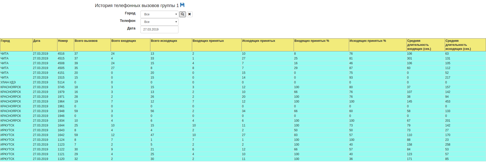

## Сбор CDR данных нескольких расположенных в разных городах АТС, консолидация данных, создание отчетной системы.

Зависимости:

[cassandra-driver](https://pypi.org/project/cassandra-driver/)

```
pip install cassandra-driver
```


Компоненты:

- **statwork.ddl** - скрипт создания структуры хранения cassandra
- **table.ddl** - отдельно создание таблицы
- **index.ddl** - отдельно создание индексов

**Пример отчета**

